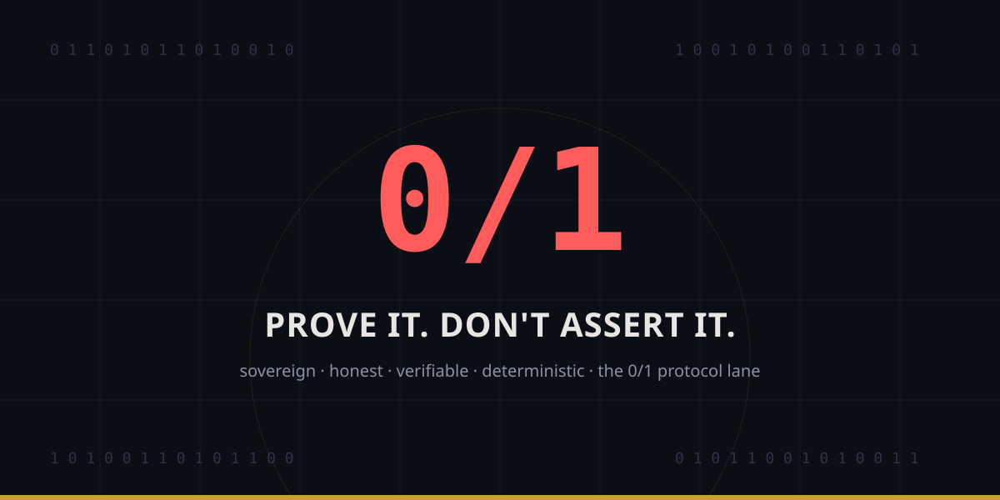

# taiko-01-protocol-demo — the 0/1 protocol lane

> two end-to-end demos, no UI fluff, pure protocol mechanics. built to answer
> one question: how far can deterministic, verifiable memory bounds be pushed
> at the preconfirmation layer before state touches L1.
>
> rust · blake3 · ed25519-dalek · mold linker · target-cpu=native · fat LTO

## idea 1 — deterministic preconfirmations via zero-alloc execution gates

a based sequencer validates, gates, and verifies a state transition before L1
inclusion. the hot path is zero-alloc — fixed-size arrays, no heap.

- `PreconfRequest` — a state transition, a monotonic sequence, an ed25519
  signature over both.
- `Gate::adjudicate` — the gate. refuses a replay, a bad signature (charging
  the no-refunds budget), or an exhausted budget; commits an accepted
  transition into a hash-verified ledger head and emits the new state root.

*it admits what it can verify and refuses what it cannot.*

## idea 2 — capability-gated agent runtime with an integrity notary

a vaked-style capability executes an off-chain computation, producing a
hash-verified monotonic trace; the notary anchors the state proof as a receipt
a verifier (a taiko L2 contract) can check.

- `Capability` — a named permission with a hard step budget.
- `Trace` — a hash-linked monotonic ledger. order matters; it is not
  commutative.
- `Notary::execute` — runs within budget or refuses, never truncates.
- `Notary::verify` — recomputes the root and checks the receipt.

*every step compiles down to 0/1 verifiability on an L2 EVM layer.*

## run

```bash
cargo test              # 7 tests: gates refuse, traces verify, order matters
cargo build --release   # target-cpu=native, fat LTO, panic=abort, stripped
```

fast-linker note: `mold` / `wild` are the intended release linkers on Linux;
macOS uses the system `ld` (mold does not yet link this project's build
scripts on Darwin).

## the pitch

> *"i built this to test how far we can push deterministic, verifiable memory
> bounds at the preconfirmation layer before state ever touches L1 storage."*

---

*eternal love for IRL support and the research background — 8b-is
(Chris, Alex, Nate). from love, from within, for all who are honest and ready
to be loved.*
